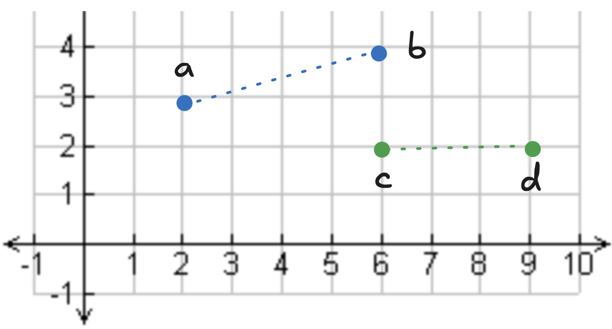
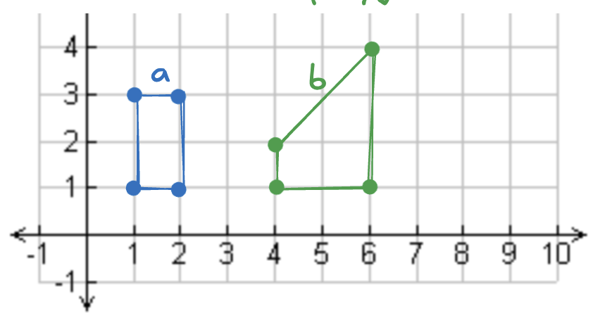
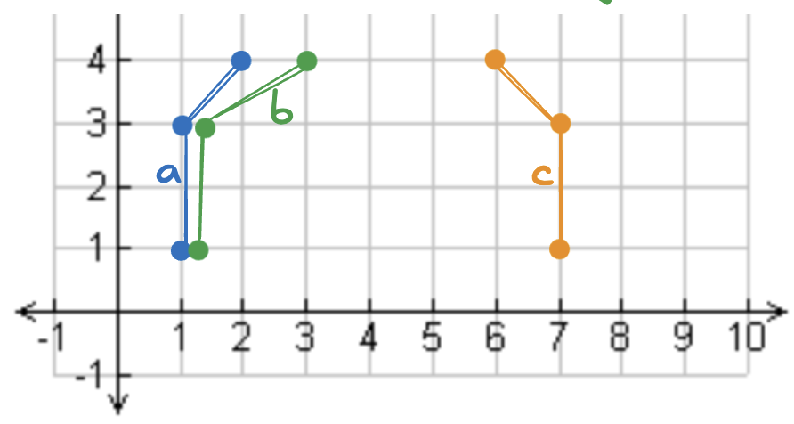
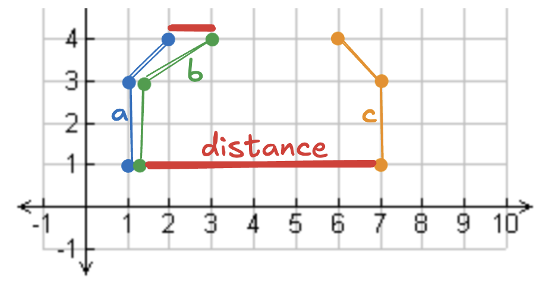
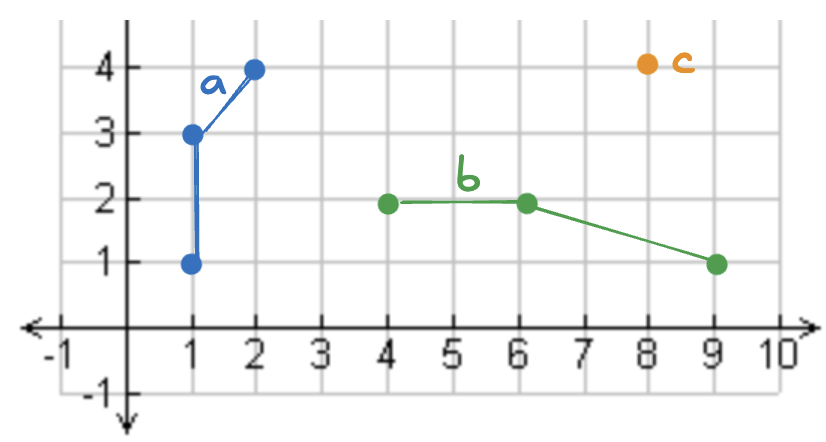

<!--
 Licensed to the Apache Software Foundation (ASF) under one
 or more contributor license agreements.  See the NOTICE file
 distributed with this work for additional information
 regarding copyright ownership.  The ASF licenses this file
 to you under the Apache License, Version 2.0 (the
 "License"); you may not use this file except in compliance
 with the License.  You may obtain a copy of the License at

   http://www.apache.org/licenses/LICENSE-2.0

 Unless required by applicable law or agreed to in writing,
 software distributed under the License is distributed on an
 "AS IS" BASIS, WITHOUT WARRANTIES OR CONDITIONS OF ANY
 KIND, either express or implied.  See the License for the
 specific language governing permissions and limitations
 under the License.
 -->

# Compute distance with Sedona and Apache Spark

This post explains how to compute the distance between two points or geometric objects using Apache Sedona and Apache Spark.

You will learn how to compute the distance on a two-dimensional Cartesian plane and how to calculate distance for geospatial data, taking into account the curvature of the Earth.

Let’s start with an example on how to compute the distance between two points in a two-dimensional Cartesian plane.

## Distance between two points with Spark and Sedona

Suppose you have four points and would like to compute the distance between `point_a` and `point_b` and the distance between `point_c` and `point_d`.



Let’s create a DataFrame with these points.

```python
df = sedona.createDataFrame([
    (Point(2, 3), Point(6, 4)),
    (Point(6, 2), Point(9, 2)),
], ["start", "end"])
```

The `start` and `end` columns both have the `geometry` type.

Now use the `ST_Distance` function to compute the distance between the points.

```python
df.withColumn(
    "distance", 
    ST_Distance(col("start"), col("end"))
).show()
```

Here are the results:

```
+-----------+-----------+-----------------+
|      start|        end|         distance|
+-----------+-----------+-----------------+
|POINT (2 3)|POINT (6 4)|4.123105625617661|
|POINT (6 2)|POINT (9 2)|              3.0|
+-----------+-----------+-----------------+
```

The `ST_Distance` function makes it relatively straightforward to compute the distance between points on a two-dimensional plane.

## Distance between two longitude/latitude points with Spark and Sedona

Let’s create two longitude/latitude points and compute the distance between them.  Start by creating a DataFrame with the longitude and latitude values.

```python
seattle = Point(-122.335167, 47.608013)
new_york = Point(-73.935242, 40.730610)
sydney = Point(151.2, -33.9)
df = sedona.createDataFrame(
    [
        (seattle, new_york),
        (seattle, sydney),
    ],
    ["place1", "place2"],
)
```

Let’s compute the distance between these points now:

```python
df.withColumn(
    "st_distance_sphere", 
    ST_DistanceSphere(col("place1"), col("place2"))
).show()
```

Here are the results:

```
+--------------------+--------------------+--------------------+
|              place1|              place2|  st_distance_sphere|
+--------------------+--------------------+--------------------+
|POINT (-122.33516...|POINT (-73.935242...|  3870075.7867602874|
|POINT (-122.33516...| POINT (151.2 -33.9)|1.2473172370818963E7|
+--------------------+--------------------+--------------------+
```

We use the `ST_DistanceSphere` function to calculate the distance, taking into account the Earth's curvature.  The function returns the distance in meters.

Let’s see how to compute the distance between two points with a spheroid model of the Earth.

## Compute distance between points with a spheroid with Spark and Sedona

Let’s use the same DataFrame from the previous section, but compute the distance using a spheroid model of the world.

```python
res = df.withColumn(
    "st_distance_spheroid", 
    ST_DistanceSpheroid(col("place1"), col("place2"))
)
res.select("place1_name", "place2_name", "st_distance_spheroid").show()
```

Here are the results:

```
+-----------+-----------+--------------------+
|place1_name|place2_name|st_distance_spheroid|
+-----------+-----------+--------------------+
|    seattle|   new_york|  3880173.4858397646|
|    seattle|     sydney|1.2456531875384018E7|
+-----------+-----------+--------------------+
```

The `ST_DistanceSpheroid` function returns the meters between the two locations.  The spheroid distance computation yields similar results to those obtained when you model the Earth as a sphere.  Expect the spheroid function to return results that are slightly more accurate.

## Distance between two geometric objects with Spark and Sedona

Let’s take a look at how to compute the distance between a linestring and a polygon.  Suppose you have the following objects:



The distance between two polygons is the minimum Euclidean distance between any two points.

Let’s compute the distance:

```python
res = df.withColumn(
    "distance",
    ST_Distance(col("geom1"), col("geom2"))
)
```

Now, take a look at the results:

```
+---+---+--------+
|id1|id2|distance|
+---+---+--------+
|a  |b  |2.0     |
+---+---+--------+
```

You can readily see the minimum distance between the two polygons in the graph.

## Three-dimensional minimum Cartesian distance

Let’s take a look at how to compute the distance between two points, factoring in the elevation of the points.

We will examine the distance between someone standing on top of the Empire State Building and someone at sea level.

Let’s create the DataFrame:

```python
empire_state_ground = Point(-73.9857, 40.7484, 0)
empire_state_top = Point(-73.9857, 40.7484, 380)
df = sedona.createDataFrame([
    (empire_state_ground, empire_state_top),
], ["point_a", "point_b"])
```

Now compute the distance and the 3D distance between the points:

```python
res = df.withColumn(
    "distance",
    ST_Distance(col("point_a"), col("point_b"))
).withColumn(
    "3d_distance",
    ST_3DDistance(col("point_a"), col("point_b"))
)
```

Take a look at the results:

```
+--------------------+--------------------+--------+-----------+
|             point_a|             point_b|distance|3d_distance|
+--------------------+--------------------+--------+-----------+
|POINT (-73.9857 4...|POINT (-73.9857 4...|     0.0|      380.0|
+--------------------+--------------------+--------+-----------+
```

`ST_Distance` does not factor in the elevation of the point.  `ST_3DDistance` factors in the elevation when measuring the distance.

## Compute Frechet distance with Spark and Sedona

Let’s create a Sedona DataFrame with the following linestrings:



Here’s how to create the Sedona DataFrame:

```python
a = LineString([(1, 1), (1, 3), (2, 4)])
b = LineString([(1.1, 1), (1.1, 3), (3, 4)])
c = LineString([(7, 1), (7, 3), (6, 4)])
df = sedona.createDataFrame([
    (a, "a", b, "b"),
    (a, "a", c, "c"),
], ["geometry1", "geometry1_id", "geometry2", "geometry2_id"])
```

Compute the Frechet distance:

```python
res = df.withColumn(
    "frechet_distance", 
    ST_FrechetDistance(col("geometry1"), col("geometry2"))
)
```

Now view the results:

```
res.select("geometry1_id", "geometry2_id", "frechet_distance").show()

+------------+------------+----------------+
|geometry1_id|geometry2_id|frechet_distance|
+------------+------------+----------------+
|           a|           b|             1.0|
|           a|           c|             6.0|
+------------+------------+----------------+
```

This image visualizes the distances so you have a better intuition for the algorithm:



## Compute the max distance between geometries with Spark and Sedona

Suppose you have the following geometric objects:



Here’s how to compute the max distance between some of these geometries.  Run the computations:

```python
res = df.withColumn(
    "max_distance",
    ST_MaxDistance(col("geom1"), col("geom2"))
)
```

Now view the results:

```
res.select("id1", "id2", "max_distance").show(truncate=False)

+---+---+-----------------+
|id1|id2|max_distance     |
+---+---+-----------------+
|a  |b  |8.246211251235321|
|a  |c  |7.615773105863909|
+---+---+-----------------+
```

You can easily find the maximum distance between two geometric objects.

## Conclusion

Sedona enables you to perform various types of distance computations.  It also allows you to compute distance based on different models of the Earth and more complex distance computations, like distance factoring in elevation.

Ensure you use the distance function that best suits your analysis.
